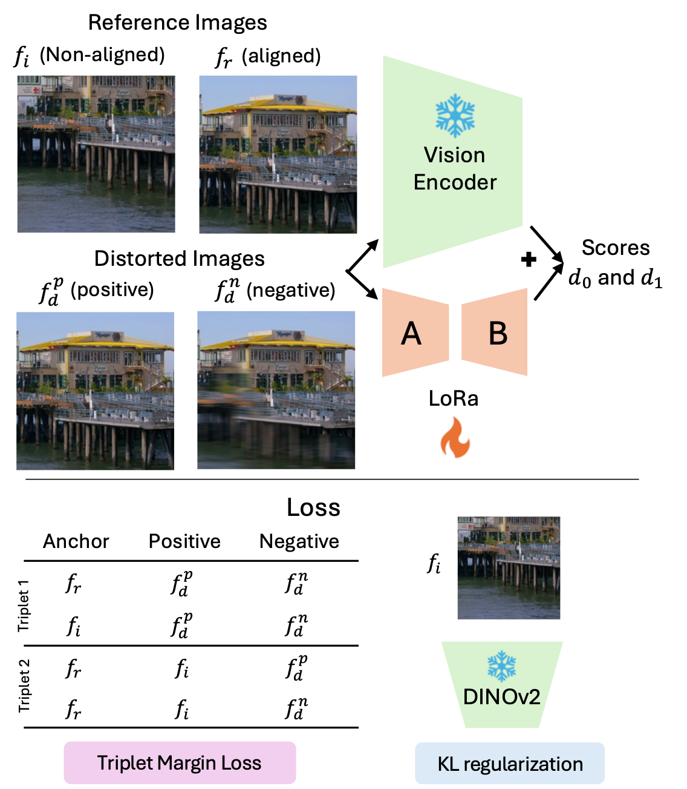

# NOVA: Non-aligned View Assessment @ WACV 2026

[](https://colab.research.google.com/github/stootaghaj/NOVA/blob/main/NOVA_Demo.ipynb)
[](https://www.python.org/downloads/)
[](https://opensource.org/licenses/MIT)

**Non-Aligned Reference Image Quality Assessment for Novel View Synthesis**

NOVA is a deep learning-based image quality assessment tool designed for evaluating Novel View Synthesis (NVS) outputs. Unlike traditional Full-Reference IQA methods that require pixel-aligned ground truth, NOVA can assess quality using non-aligned reference views that share scene content but lack pixel-level alignment.

## 📄 Paper

> **Non-Aligned Reference Image Quality Assessment for Novel View Synthesis**  
> Abhijay Ghildyal, Rajesh Sureddi, Nabajeet Barman, Saman Zadtootaghaj, Alan Bovik  
> *Accepted at WACV 2026*

For dataset and more details, visit our [project page](https://stootaghaj.github.io/nova-project/).

## 🏗️ Model Architecture

<p align="center">
  
</p>

NOVA is built on **DINOv2** (ViT-B/14) enhanced with LoRA fine-tuning, trained using:
- **Contrastive triplet loss** for learning perceptual quality embeddings
- **KL divergence regularization** to maintain alignment with pretrained DINOv2 space
- **IQA model supervision** from DISTS and DeepDC for human-aligned quality assessment

## 🎯 Features

- **Non-Aligned Reference IQA**: Assess quality using reference views without requiring pixel-level alignment
- **NVS-Optimized**: Trained on synthetic distortions targeting Temporal Regions of Interest (TROI)
- **LoRA-Enhanced DINOv2**: Built on contrastive learning with fine-tuned DINOv2 embeddings
- **Cosine Distance Metric**: Quantify visual similarity between synthesized views and references
- **Heatmap Visualization**: Visualize difference regions overlayed on the distorted frame

## 📦 Installation

### Requirements

- Python 3.8+
- PyTorch 1.12+
- timm
- torchvision
- PIL
- matplotlib
- numpy

### Install

```bash
# Clone the repository
git clone https://github.com/stootaghaj/NOVA.git
cd NOVA

# Install dependencies
pip install -r requirements.txt
```

### Model Weights

We provide two pre-trained checkpoints via [Git LFS](https://git-lfs.github.com/):

| Checkpoint | Training Data | Description |
|------------|--------------|-------------|
| `weights/NOVA_baseline.pt` | Synthetic distortions | Trained on synthetically distorted data. Reproduces the results reported in the paper. |
| `weights/NOVA_NVS.pt` | NVS distortions | Fine-tuned on real NVS artifacts. **Recommended for NVS quality assessment.** |

> **Note**: The results reported in the paper were obtained using `NOVA_baseline.pt`. For practical NVS quality evaluation, we recommend `NOVA_NVS.pt` as it has been additionally trained on real Novel View Synthesis artifacts and generalizes better to NVS distortions.

The weights are downloaded automatically when you clone the repository. If they weren't downloaded (e.g., Git LFS not installed), run:

```bash
git lfs install
git lfs pull
```

> For more details and dataset, visit our [project page](https://stootaghaj.github.io/nova-project/).

## 🚀 Quick Start

### Command Line

```bash
# Basic quality assessment with fine-tuned checkpoint
python nova.py --image-a reference.png --image-b synthesized.png \
    --checkpoint weights/NOVA_NVS.pt

# With heatmap visualization overlay
python nova.py --image-a reference.png --image-b synthesized.png \
    --checkpoint weights/NOVA_NVS.pt --visualize --out ./results
```

### Python API

```python
from nova import load_model, compute_cosine_distance, run_visualization, pick_device

# Load model with fine-tuned checkpoint
device = pick_device("auto")
model = load_model(checkpoint_path="weights/NOVA_NVS.pt", device=device)

# Compute cosine distance (lower = more similar)
result = compute_cosine_distance(
    model,
    image_a="reference.png",      # Reference view (can be non-aligned)
    image_b="synthesized.png",    # Synthesized/distorted view
    device=device
)
print(f"Cosine Distance: {result['cosine_distance']:.4f}")
print(f"Cosine Similarity: {result['cosine_similarity']:.4f}")

# Generate heatmap overlay on synthesized view
vis_result = run_visualization(
    model,
    image_a="reference.png",
    image_b="synthesized.png",
    output_dir="./output",
    device=device,
    alpha=0.5  # Heatmap transparency
)
```

### Batch Processing

Create a JSON configuration file (`pairs.json`):

```json
[
  {
    "image_a": "samples/reference1.png",
    "image_b": "samples/synthesized1.png"
  },
  {
    "image_a": "samples/reference2.png",
    "image_b": "samples/synthesized2.png"
  }
]
```

Run batch processing:

```bash
python nova.py --config pairs.json --out ./batch_results \
    --checkpoint weights/NOVA_NVS.pt --visualize
```

## 📊 Output

### Cosine Distance

The primary output is the **cosine distance** between image embeddings:
- `0.0` = Identical/very similar views
- Higher values = Greater perceptual difference

### Visualization Output

When `--visualize` is enabled:

| File | Description |
|------|-------------|
| `heatmap_overlay.png` | Difference heatmap overlayed on the synthesized frame |
| `summary.json` | Statistics and metadata |

The heatmap highlights regions where the synthesized view differs most from the reference. Brighter/warmer colors indicate larger differences, typically corresponding to NVS artifacts.

## 🔧 CLI Options

```
usage: nova.py [-h] [--image-a IMAGE_A] [--image-b IMAGE_B]
               [--config CONFIG] [--checkpoint CHECKPOINT]
               [--model-name MODEL_NAME] [--resize RESIZE]
               [--device {auto,cpu,cuda,mps}] [--visualize]
               [--out OUT] [--alpha ALPHA]

Options:
  --image-a          Path to reference image (can be non-aligned)
  --image-b          Path to synthesized/distorted image
  --config           JSON config file with image pairs
  --checkpoint       Path to model checkpoint (weights/NOVA_NVS.pt)
  --model-name       Base model name (default: vit_base_patch14_dinov2.lvd142m)
  --resize           Image resize dimension (default: 518)
  --device           Device: auto, cpu, cuda, mps (default: auto)
  --visualize        Enable heatmap overlay visualization
  --out              Output directory (default: ./output)
  --alpha            Heatmap overlay transparency, 0-1 (default: 0.5)
```

## 📁 Project Structure

```
NOVA/
├── nova.py                 # Main module
├── requirements.txt        # Dependencies
├── README.md               # Documentation
├── LICENSE                 # MIT License
├── NOVA_Demo.ipynb         # Google Colab notebook
├── fig/                    # Figures
│   └── Model_Arc.png       # Model architecture diagram
├── samples/                # Example images
│   ├── frame1.png
│   └── frame2.png
└── weights/                # Model weights
    ├── README.md           # Download instructions
    ├── NOVA_baseline.pt    # Baseline checkpoint (paper results)
    └── NOVA_NVS.pt         # NVS-optimized checkpoint (recommended)
```

## 📓 Google Colab

Try it directly in your browser:

[](https://colab.research.google.com/github/stootaghaj/NOVA/blob/main/NOVA_Demo.ipynb)

## 📚 Citation

If you use NOVA in your research, please cite:

```bibtex
@inproceedings{ghildyal2026nova,
  title={Non-Aligned Reference Image Quality Assessment for Novel View Synthesis},
  author={Ghildyal, Abhijay and Sureddi, Rajesh and Barman, Nabajeet and Zadtootaghaj, Saman and Bovik, Alan},
  booktitle={Proceedings of the IEEE/CVF Winter Conference on Applications of Computer Vision (WACV)},
  year={2026}
}
```

## 🤝 Contributing

Contributions are welcome! Please feel free to submit a Pull Request.

## 📄 License

This project is licensed under the MIT License - see the [LICENSE](LICENSE) file for details.

## 🙏 Acknowledgments

- [DINOv2](https://github.com/facebookresearch/dinov2) by Meta AI Research
- [timm](https://github.com/huggingface/pytorch-image-models) by Ross Wightman

---

© 2025 University of Texas at Austin. All rights reserved.

